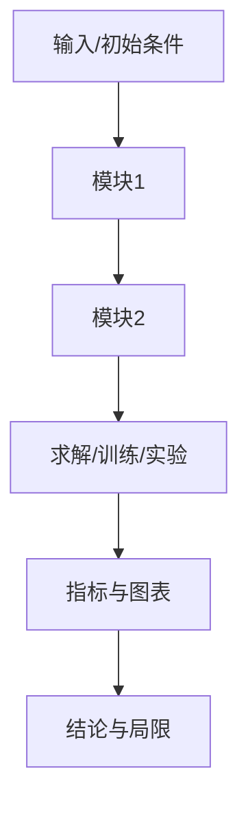

# 精读笔记

## 0. 主线地图

```text
问题 -> 研究对象/变量 -> 假设 -> 方法模块 -> 核心公式/算法 -> 求解/训练/评测 -> 结果 -> 局限 -> 改进
```

用 5-8 句话先写出本文主线：

## 1. 问题定义
| 类别 | 内容 | 论文位置 | 是否充分说明 |
|---|---|---|---|
| 研究对象 |  |  |  |
| 输入 |  |  |  |
| 输出 |  |  |  |
| 状态变量 |  |  |  |
| 控制变量 |  |  |  |
| 参数 |  |  |  |
| 评价指标 |  |  |  |

## 2. 假设审计
| 假设 | 简化了什么 | 适用条件 | 潜在偏差 | 可如何放宽 |
|---|---|---|---|---|
|  |  |  |  |  |

## 3. 方法模块与耦合关系
| 模块 | 解决主线中的哪一步 | 输入 | 核心关系 | 输出 | 与其他模块的耦合 |
|---|---|---|---|---|---|
|  |  |  |  |  |  |

## 4. 方法流程图



## 5. 核心方程、算法或模型
| 编号 | 作用 | 来源 | 已知量 | 未知量 | 边界/初始条件 | 实现映射 |
|---|---|---|---|---|---|---|
|  |  |  |  |  |  |  |

逐个公式/算法按六步解释：作用、符号/单位、来源、上下游接口、一致性检查、代码或实验实现。

## 6. 参数、条件与数据
| 参数/条件/数据 | 含义 | 数值/范围 | 单位 | 来源 | 敏感性/风险 |
|---|---|---:|---|---|---|
|  |  |  |  |  |  |

## 7. 求解、训练或实验流程
```text
输入准备 -> 参数初始化 -> 主模型/实验步骤 -> 中间量更新 -> 收敛/停止判断 -> 后处理 -> 指标计算 -> 对照比较
```

每一步说明输入、输出、循环条件、停止条件和可能的信息缺口。

## 8. 主张—证据表
| 作者主张 | 需要的证据 | 论文实际证据 | 是否充分 | 风险/替代解释 |
|---|---|---|---|---|
|  |  |  |  |  |

## 9. 核心图表机理
| 图表 | 横纵轴/条件 | 主要现象 | 因果或机制链 | 能支持什么 | 不能支持什么 |
|---|---|---|---|---|---|
|  |  |  |  |  |  |

## 10. 创新点复核
| 创新点 | 新在哪里 | 与已有工作的差别 | 证据是否足够 | 成立条件 |
|---|---|---|---|---|
|  |  |  |  |  |

## 11. 局限性与改进方向
| 局限来源 | 影响的结论/范围 | 改进方案 | 预期收益 | 新增成本 | 验证指标 |
|---|---|---|---|---|---|
|  |  |  |  |  |  |

## 12. 与我的课题的联系
- 可直接借用：
- 需要重新验证：
- 可作为基线/对照：
- 可形成论文增量：
- 与当前方向的冲突：

## 13. 尚未解决的问题
1. 
2. 
3. 

## 14. 精读检查
不看论文，尝试复述：

> 本文研究……问题；在……假设下，用……方法，通过……证据支持……结论；主要风险是……，下一步可以……。
