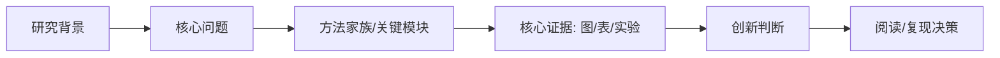

# 粗读卡片

## 基本信息
- 标题：
- 作者：
- 年份与来源：
- 论文类型：理论 / 数值仿真 / 实验 / 算法与机器学习 / 综述 / 其他
- 阅读材料范围：全文 / 摘要 / 截图 / 部分章节 / 代码仓库 / 其他
- 与我的研究关联度：高 / 中 / 低 / 待判断

## 一句话概括
本文针对……问题，采用……方法，得到……结果，主要贡献是……。

## 研究背景
- 领域位置：
- 为什么重要：
- 已有方法的主要不足：

## 核心问题
用一个疑问句重写作者真正要回答的问题：

> ……？

## 研究缺口
| 已有研究已经解决 | 尚未解决 | 本文选择解决 |
|---|---|---|
|  |  |  |

## 总体方法
- 方法家族：
- 关键模块：
- 主线：背景 -> 问题 -> 方法 -> 验证 -> 结论

## 主要结果与证据
| 结论 | 对应图/表/实验 | 证据强度 | 备注 |
|---|---|---|---|
|  |  | 强 / 中 / 弱 / 待核验 |  |

## 创新点
| 创新类型 | 具体内容 | 是否由证据支撑 | 依赖条件 |
|---|---|---|---|
| 新问题 / 新模型 / 新机制 / 新算法 / 新实验 / 新应用 |  |  |  |

## 复现门槛
| 项目 | 状态 | 风险 | 处理建议 |
|---|---|---|---|
| 代码 | 有 / 无 / 待查 |  |  |
| 数据 | 有 / 无 / 待查 |  |  |
| 指标与评测脚本 | 清楚 / 不清楚 / 待查 |  |  |
| 参数与超参数 | 完整 / 部分 / 缺失 |  |  |
| 软件依赖 | 固定 / 未固定 / 待查 |  |  |
| 硬件或实验条件 | 可承受 / 较重 / 不可承受 / 待查 |  |  |
| 预计复现层级 | 公式 / 模型 / 结果 / 扩展 |  |  |

## 三个待查问题
1. 
2. 
3. 

## 阅读决策
- [ ] 停止，不值得继续投入
- [ ] 作为背景文献保存
- [ ] 继续精读
- [ ] 进入公式复现
- [ ] 进入模型复现
- [ ] 进入结果复现
- [ ] 进入扩展复现
- 原因：

## 可视化摘要图

> 粗读结果最后必须附一张图。优先使用 Mermaid；如果环境支持图片生成或渲染，也可输出 PNG/SVG/Markdown image。

